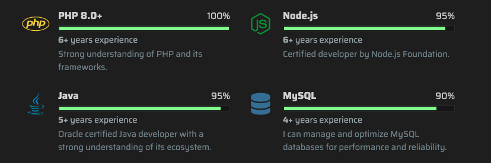

#  Tutorial 11 – ArticleSkills

## Preview



The `ArticleSkills` component is used for displaying a list of skills or technologies.

## Basic Working Example

Just copy and paste this into a section's `articles` array and see the magic happen:

```json
{
    "id": 1,
    "component": "ArticleSkills",
    "locales": {
        "en": {"title": "{{Frontend}} Stack"}
    },
    "settings": {
        "max_items_per_row": 3,
        "max_rows_collapse_threshold": 6,
        "order_items_by": "percentage",
        "order_items_sort": "desc",
        "round_icons": false
    },
    "items": [
        {
            "id": 1,
            "img": "",
            "faIcon": "fa-brands fa-html5",
            "faIconColors": {"bg": "", "fill": "#E34F26"},
            "date": {"year": 2018, "month": 9},
            "percentage": 100,
            "locales": {
                "en": {
                    "title": "HTML 5",
                    "text": "I am proficient in HTML5 for building structured web pages.",
                    "level": ""
                }
            }
        },

        {
            "id": 2,
            "img": "",
            "faIcon": "fa-brands fa-css3-alt",
            "faIconColors": {"bg": "", "fill": "#1572B6"},
            "date": {"year": 2019, "month": 1},
            "percentage": 65,
            "locales": {
                "en": {
                    "title": "CSS 3",
                    "text": "I can create responsive and visually appealing designs using CSS3.",
                    "level": ""
                }
            }
        },

        {
            "id": 3,
            "img": "",
            "faIcon": "fa-brands fa-js",
            "faIconColors": {"bg": "", "fill": "#F7DF1E", "fillLight": "#a69617"},
            "date": {"year": 2020, "month": 3},
            "percentage": 90,
            "locales": {
                "en": {
                    "title": "JavaScript ES6+",
                    "text": "Mastered JavaScript ES6+ for dynamic and interactive web applications.",
                    "level": ""
                }
            }
        }
    ]
}
```

### Required Settings

| Property                                  | Type    | Description                                                                                                                   |
|-------------------------------------------|---------|-------------------------------------------------------------------------------------------------------------------------------|
| `max_items_per_row`                       | NUMBER  | Defines the maximum number of items per row. It can be `1`, `2` or `3`.                                                       |
| `max_rows_collapse_threshold`             | NUMBER  | Defines the maximum number of rows before collapsing. When collapsed, the app displays a "See more" button. Recommended: `6`. |
| `order_items_by`                          | STRING  | Defines the item key that will be used for ordering items.                                                                    |
| `order_items_sort`                        | STRING  | Defines the direction of the order. Use `"asc"` (ascending) or `"desc"` (descending).                                         |
| `round_icons`                             | BOOLEAN | Defines whether to use solid round icons with borders. Default: `false`.                                                      |

## Item Structure

Each item of `ArticleSkills` represents a skill or technology.

### Empty Item Model
```json
{
    "id": 0,
    "img": "",
    "faIcon": "",
    "faIconColors": {"bg": "", "bgLight": "", "fill": "", "fillLight": ""},
    "date": {"year": 1900, "month": 1},
    "percentage": 0,
    "locales": {
        "en": {
            "title": "",
            "text": "",
            "level": ""
        }
    }
}
```

### ⚡ Item Static Fields

| Property               | Type               | Required? | Description                                                                                                                                                                                      |
|------------------------|--------------------|-----------|--------------------------------------------------------------------------------------------------------------------------------------------------------------------------------------------------|
| `id`                   | NUMBER             | REQUIRED  | A unique ID for the item within the article.                                                                                                                                                     |
| `img`                  | STRING (URL)       | OPTIONAL  | Path to the image shown in the avatar. Must be relative to `public/`. If not provided, the article falls back to the `faIcon`.                                                                   |
| `faIcon`               | STRING             | OPTIONAL  | A [Font Awesome](https://fontawesome.com/search?ic=free) icon used as a fallback if no image is specified (now supporting [PrimeIcons](https://www.primefaces.org/diamond/icons.xhtml) as well!) |
| `faIcon.bg`            | STRING (HEX COLOR) | OPTIONAL  | Custom background color for the `faIcon`. Defaults to the theme dark color.                                                                                                                      |
| `faIcon.bgLight`       | STRING (HEX COLOR) | OPTIONAL  | Custom background color for the `faIcon` in light themes. Defaults to theme dark color.                                                                                                          |
| `faIcon.fill`          | STRING (HEX COLOR) | OPTIONAL  | Custom `faIcon` fill color for dark themes. Defaults to the current theme's text color.                                                                                                          |
| `faIcon.fillLight`     | STRING (HEX COLOR) | OPTIONAL  | Custom `faIcon` fill color for light themes. Defaults to the current theme's text color.                                                                                                         |
| `date`                 | OBJECT             | OPTIONAL  | A date that represents when you started using this technology — used for calculating your experience time. Must contain `year` and `month`.                                                      | 
| `percentage`           | NUMBER             | OPTIONAL  | A number from `0` to `100` representing your proficiency in this skill. If not provided or equals to zero, the progress bar will not be displayed.                                               |                                                       

### 🌐 Item Locales Fields

| Property | Type   | Required?   | Description                                                                    |
|----------|--------|-------------|--------------------------------------------------------------------------------|
| `title`  | STRING | REQUIRED    | The skill name.                                                                |
| `text`   | STRING | OPTIONAL    | A short description explaining the skill.                                      |
| `level`  | STRING | OPTIONAL    | Something like 'Fluent' or 'Advanced' — shown next to the title. Not required. |

> **Note:** All fields in the locales object support the following custom formatting:
>- `{{Some text...}}` for highlighting a text.
>- `[[Some text...]]` for making a text bold.
>
> **Note 2:** Required and recommended fields must be present **at least** in the default language.

## My Configuration

Below are the two `ArticleSkills` articles used in this portfolio's `skills.json`.

### Backend Stack

```json
{
    "id": 2,
    "component": "ArticleSkills",
    "locales": {
        "en": {"title": "Backend Stack"}
    },
    "settings": {
        "max_items_per_row": 3,
        "max_rows_collapse_threshold": 6,
        "order_items_by": "percentage",
        "order_items_sort": "desc",
        "round_icons": false
    },
    "items": [
        {
            "id": 1,
            "faIcon": "fa-solid fa-gem",
            "faIconColors": {"bg": "", "fill": "#CC0000"},
            "date": {"year": 2020, "month": 6},
            "percentage": 90,
            "locales": {
                "en": {
                    "title": "Ruby on Rails",
                    "text": "My primary backend framework — building scalable RESTful APIs and full-stack web applications.",
                    "level": "Advanced"
                }
            }
        },
        {
            "id": 2,
            "faIcon": "fa-solid fa-database",
            "faIconColors": {"bg": "", "fill": "#4479A1"},
            "date": {"year": 2020, "month": 6},
            "percentage": 88,
            "locales": {
                "en": {
                    "title": "MySQL",
                    "text": "Designing schemas, writing complex queries, and optimizing performance for production databases.",
                    "level": "Advanced"
                }
            }
        },
        {
            "id": 3,
            "faIcon": "fa-solid fa-server",
            "faIconColors": {"bg": "", "fill": "#CC2927"},
            "date": {"year": 2021, "month": 3},
            "percentage": 80,
            "locales": {
                "en": {
                    "title": "SQL Server",
                    "text": "Working with Microsoft SQL Server for enterprise-grade relational database solutions.",
                    "level": "Proficient"
                }
            }
        },
        {
            "id": 4,
            "faIcon": "fa-solid fa-magnifying-glass",
            "faIconColors": {"bg": "", "fill": "#005571"},
            "date": {"year": 2021, "month": 9},
            "percentage": 75,
            "locales": {
                "en": {
                    "title": "Elasticsearch",
                    "text": "Implementing full-text search and analytics at scale using Elasticsearch in production systems.",
                    "level": "Proficient"
                }
            }
        },
        {
            "id": 5,
            "faIcon": "fa-solid fa-filter",
            "faIconColors": {"bg": "", "fill": "#D9411E"},
            "date": {"year": 2022, "month": 1},
            "percentage": 70,
            "locales": {
                "en": {
                    "title": "Apache Solr",
                    "text": "Configuring and integrating Solr for enterprise search and faceted filtering.",
                    "level": "Proficient"
                }
            }
        },
        {
            "id": 6,
            "faIcon": "fa-brands fa-google",
            "faIconColors": {"bg": "", "fill": "#4285F4"},
            "date": {"year": 2022, "month": 6},
            "percentage": 70,
            "locales": {
                "en": {
                    "title": "Google Cloud",
                    "text": "Deploying and managing cloud infrastructure including GCS, Cloud Run, and BigQuery on GCP.",
                    "level": "Proficient"
                }
            }
        },
        {
            "id": 7,
            "faIcon": "fa-solid fa-window-maximize",
            "faIconColors": {"bg": "", "fill": "#512BD4"},
            "date": {"year": 2021, "month": 6},
            "percentage": 75,
            "locales": {
                "en": {
                    "title": ".NET",
                    "text": "Building web APIs and enterprise applications using ASP.NET Core.",
                    "level": "Proficient"
                }
            }
        }
    ]
}
```

### Frontend & Mobile Stack

```json
{
    "id": 3,
    "component": "ArticleSkills",
    "locales": {
        "en": {"title": "Frontend & Mobile Stack"}
    },
    "settings": {
        "max_items_per_row": 3,
        "max_rows_collapse_threshold": 6,
        "order_items_by": "percentage",
        "order_items_sort": "desc",
        "round_icons": false
    },
    "items": [
        {
            "id": 1,
            "faIcon": "fa-brands fa-react",
            "faIconColors": {"bg": "", "fill": "#61DAFB", "fillLight": "#317385"},
            "date": {"year": 2021, "month": 1},
            "percentage": 90,
            "locales": {
                "en": {
                    "title": "Next.js",
                    "text": "Building performant, SEO-friendly web apps with Next.js — SSR, SSG, API routes, and App Router.",
                    "level": "Advanced"
                }
            }
        },
        {
            "id": 2,
            "faIcon": "fa-brands fa-react",
            "faIconColors": {"bg": "", "fill": "#61DAFB", "fillLight": "#317385"},
            "date": {"year": 2020, "month": 6},
            "percentage": 85,
            "locales": {
                "en": {
                    "title": "React",
                    "text": "Strong command of React hooks, context, and component architecture for modern UIs.",
                    "level": "Advanced"
                }
            }
        },
        {
            "id": 3,
            "faIcon": "fa-brands fa-react",
            "faIconColors": {"bg": "", "fill": "#00D8FF", "fillLight": "#007a91"},
            "date": {"year": 2022, "month": 3},
            "percentage": 75,
            "locales": {
                "en": {
                    "title": "React Native",
                    "text": "Developing cross-platform mobile apps for iOS and Android with React Native.",
                    "level": "Proficient"
                }
            }
        },
        {
            "id": 4,
            "faIcon": "fa-brands fa-js",
            "faIconColors": {"bg": "", "fill": "#F7DF1E", "fillLight": "#a69617"},
            "date": {"year": 2019, "month": 6},
            "percentage": 88,
            "locales": {
                "en": {
                    "title": "JavaScript ES6+",
                    "text": "Deep understanding of modern JavaScript — async/await, modules, closures, and TypeScript basics.",
                    "level": "Advanced"
                }
            }
        },
        {
            "id": 5,
            "faIcon": "fa-brands fa-html5",
            "faIconColors": {"bg": "", "fill": "#E34F26"},
            "date": {"year": 2019, "month": 1},
            "percentage": 92,
            "locales": {
                "en": {
                    "title": "HTML5 / CSS3",
                    "text": "Solid foundation in semantic HTML and responsive CSS including Flexbox and Grid.",
                    "level": "Advanced"
                }
            }
        }
    ]
}
```

## Next Steps
Ready to keep going? Check out the next tutorial or revisit the previous one if you need a refresher:

⬅️ [Previous: ArticleCards](./TUTORIAL_10_ARTICLE_CARDS.md)
&nbsp;&nbsp;&nbsp;&nbsp;&nbsp;&nbsp;|&nbsp;&nbsp;&nbsp;&nbsp;&nbsp;&nbsp;
[Next: ArticleTimeline](./TUTORIAL_12_ARTICLE_TIMELINE.md) ➡️ 
